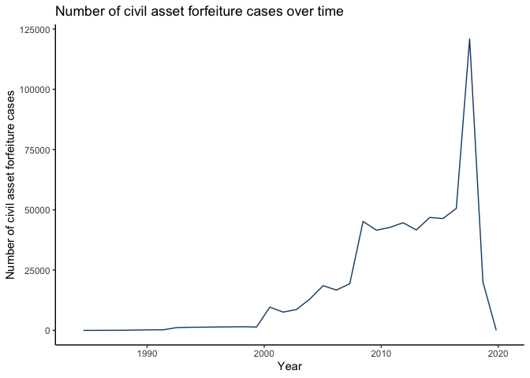

Profit from Policing : Allocation of Civil Asset Forfeiture Funds
================
Yuhang Li
7/10/2023

# Introduction

Civil asset forfeiture is one of the most controversial policies in the
United States. Civil asset forfeiture is a legal process that allows
police officers to take and keep property that they suspect has been
involved in criminal activity. Under this policy, police officers do not
need to provide evidence that the original owner has committed a crime.
Proponents of the policy state that civil asset forfeiture acts as a law
enforcement tool to reduce material-related crime such as drug sales or
vehicle crimes. However, the policy has also been criticized for its
abusive use by police officers who seize cash and property from innocent
civilians with the incentive to generate revenue. Therefore, it is
important for policy makers to determine the source and allocation of
civil asset forfeiture funds. In particular, what trends does revenue
generated from civil asset forfeiture follow, and how are forfeiture
funds spent?

This data analysis report aims to examine patterns in expenditure and
revenue of civil asset forfeiture funds over time. The report uses
national and state level revenue and expense data to answer the research
question. Results may lead to more insights on the financial incentives
behind civil asset forfeiture laws and the impact of forfeiture revenue
on budgets of law enforcement agencies.

# Data

The [Institute for
Justice](https://ij.org/report/policing-for-profit-3/policing-for-profit-data/)
provides federal and state level data of civil asset forfeiture cases
from 1986 - 2019. The data sets contain information about the type of
property forfeited, the amount of revenue gained from the forfeiture,
and the expenditure amount and allocation of forfeiture funds.
Unfortunately, data is not available for all states and many states are
not simultaneously present in both revenue and expense data. Thus, I
chose to conduct the majority of my analysis at the national level by
which more data is available. In addition, I will analyze fund patterns
in Illinois, the state with the highest number of forfeiture cases.

# Data Analysis

## Part 1 : National Revenue and Expenditure of Civil Asset Forfeiture Funds (1986 - 2019)

### Variations in national revenue

Civil asset forfeiture existed for a long time in the United States but
attracted increased attention in the 1980s as illegal drug activity
increased in frequency. The right to seize materials from people with
suspected involvement in criminal activity was aimed at reducing further
illegal activity or trade. The graphs below show trends of the frequency
of civil asset forfeiture cases in the United States from the period
1986 to 2019.

<!-- -->

National data shows that the number of civil asset forfeiture cases
remained relatively stable until 1999. After that, from 2000 - 2019, the
number of cases increased almost exponentially to over 100,000 cases.
The number of cases peaked in 2018 to 125,000 cases. This could be
attributed to many factors such as increased law enforcement activity,
rapid policy changes related to civil asset forfeiture, financial
motivations, or increased public attention on this topic in recent
years.

<!-- -->

The graph above shows that the average revenue from civil asset
forfeiture was extraordinarily high in 2014 and 2015 and averaged to
over 200,000 dollars in each of the two years. This may be due to policy
changes and regulations such as the Civil Asset Forfeiture Reform Act of
2014 that refines the scope and conditions of civil asset forfeiture.
Law enforcement agencies could be more active in those years in
targeting and seizing asset related to criminal activities, leading to a
spike in revenues. If more time was given, I would conduct more detailed
research on changes to civil asset forfeitures laws in 2014 and 2015 in
different states.

### Expenditure proportions

<!-- -->

An analysis of expenditure data on the national level shows that the
highest proportion of total expenditure is spent on capital expenditures
(36%) and the lowest proportion is spent on victim compensation (0.10%).
This suggests that almost no funds are allocated to services for victims
and communities and that most of the funds gained from forfeiture are
allocated to improving the facilities or equipment of law enforcement
agencies. In the case that property is taken from innocent individuals,
the revenue is not paid back to the community but instead directed to
the finances of law enforcement agencies.

### Conviction outcomes

The national level data set also provides information on whether the
individuals whose property is confiscated end up being convicted or not.
The following table shows the percentage of cases in which the owner
involved was convicted of crime after confiscation of their property.

| Property type | Percent convicted after seizure |
|:--------------|:--------------------------------|
| other         | 17.84%                          |
| real property | 17.07%                          |
| currency      | 5.19%                           |
| vehicles      | 4.95%                           |

Percentage of civil asset forfeitures with convicted outcomes

As shown by the table, only a minority of civil asset forfeitures
involved cases with owners eventually convicted of crime. The proportion
of positive conviction outcomes is around three times higher for real
property seizures than for currency and and vehicle seizures. This
indicates that most suspected seizures, especially currency and
vehicles, are actually from innocent individuals. These individuals
often do not have the resources or means to file a case and regain their
lost property.

### Variations by state

Since different states have different laws regarding civil asset
forfeiture, it may be useful to examine revenue and expense patterns at
the state level. The following graph shows the top 10 states that had
the most occurrences of civil asset forfeiture and the 10 states that
had the least occurrences.

<!-- -->

The graph shows states that has the most and least number of civil asset
forfeiture cases recorded in the data during the period of 1986 - 2019.
Interestingly, there is a large difference in the top ten and bottom ten
states. The ten states that had the least number of civil asset
forfeitures only had several hundred cases, while the ten states that
had the most civil asset forfeitures generally had 25,000 to 100,000
cases. The state with the highest number of occurrences is Illinois with
98,153 cases and the state with the lowest number of occurrences is West
Virginia with only 114 cases. This suggests the existence of a wide
disparity in civil asset forfeiture occurrences in the United States.
Civil asset forfeiture is much more popular in some states than in
others, which is potentially due to local law enforcement regulations or
differences in state legislature.

The provided state level data sets do not contain the expense and
revenue data simultaneously for some states. Since Illinois ranked the
highest in the number of civil asset forfeitures and has complete state
level data, I decided to closely examine civil asset forfeiture trends
at the state level for Illinois.

## Part 2 : Case Study of Illinois

Currently, according to [Illinois Policy
Reports](https://www.illinoispolicy.org/reports/asset-forfeiture-in-illinois/),
state law in Illinois authorizes the forfeiture of property, vehicles,
vessels and aircraft, currency, and drugs on the basis of the property
allegedly having been used in the commission of any crimes. A large
percentage of revenue profits state agencies with the rest shared by the
federal government. Reform policies are in progress to provided more
transparency about how forfeiture funds are acquired and used.

### Summary statistics

         Summary statistics for revenue, expenditure, and agency share          
               Variable     Min    Q1   Median     Q3        Max  
             ─────────────────────────────────────────────────────
               revenue        0   278      714   2094   17396274  
               expenditur     0     0        0      0    3189760  
               e                                                  
               agency         0    64      175    538      86450  
               share                                              

Column names: Variable, Min, Q1, Median, Q3, Max

The above table shows the summary statistics for the revenue gained from
forfeiture, expenditure amount of forfeiture funds, and the amount of
revenue the agency gains in Illinois. The median and the maximum value
differ by an extreme amount, which suggests that the distribution of the
three variables is highly skewed and has a lot of outliers. Assuming
correct data entry, this could indicate that revenue and expenditure
funds in Illinois vary greatly between different agencies. For instance,
Chicago Police Department has a relatively high amount of revenue
compared to other agencies in Illinois. Size of agency, number of
employees, and surveillance area can all influence the amount of funds
gained and spent.

### Average revenue over time

<!-- -->

The graph above analyzes the trend of average revenue over the years
provided in the dataset, from 2000 - 2019. Unlike the national average
revenue trend in part 1, the average revenue from civil asset forfeiture
in Illinois remained relatively high until 2007 then decreased abruptly
and remained at low values from 2010 - 2019. One explanation of this
drop in average revenue may be stricter regulations regarding
forfeitures. In recent years, seizures and forfeitures must be publicly
reported and a substantial proof of crime upon seizure is emphasized by
the government.

### Expenditure proportions in Illinois

Since distribution of variables are highly skewed, analysis of
expenditure is better done by calculating the proportion of total
expenditure of each type of expense and visualizing the results in a pie
chart.

<!-- -->

The above pie chart shows the proportion of total expenditure of
different types of expenditure areas. Similar to results from the
national data, it is clear that the majority of forfeiture funds in
Illinois is spent on capital expenditures. A small proportion is spent
on community programs. This suggests that civil asset forfeiture is a
crucial component of the finances of local agencies and largely
contributes to the purchase of equipment and other capital projects.

# Conclusion

Every year, law enforcement agencies gain large amounts of revenue from
cash, vehicles, and property confiscations from civilians. Data analysis
results at the national level and the state level for Illinois both show
that civil asset forfeiture funds are important components for financing
capital expenditures of these agencies. However, at the national level,
the majority of civil asset forfeiture cases did not involve individuals
who are guilty of crime. The heavy allocation of forfeiture funds to
capital expenditures may introduce incentives for law enforcement
agencies to engage in “policing for profit”, which harms innocent
property owners.

# Caveats and Further Steps

The analysis of this report may be subject to certain limitations.
First, the provided national and state level data sets contained many
“NA” values for each column. This may be caused by errors in data
collecting and may affect the results of the data analysis to a certain
degree.

Secondly, it is likely that the type of property being confiscated
impacts the need for civil asset forfeiture laws. For instance, cases
involving drugs and other illegal substances may require civil asset
forfeiture to a larger degree than cases involving currency or vehicles.
Civil asset forfeiture of illegal substances may be particularly
effective in preventing further dissemination and harm. Even if the
owner of illegal drugs is not convicted of crime, confiscation of the
substance likely reduces its presence in the country. The provided data
set does not specify what the “other” category of property type
contains, so cases involving drug activity cannot be analyzed. Given
more time, I would research more on the relationship between civil asset
forfeiture and different types of property forfeited.

# References

“Data Sources.” Institute for Justice. July 10, 2023. [Institute for
Justice](https://ij.org/report/policing-for-profit-3/policing-for-profit-data/).

Ruddell, Ben and Jackson-Green, Bryant. “Asset forfeiture in Illinois:
What it is, where it happens, and reforms the state needs.” Illinois
Policy. July 10, 2023.[Illinois Policy
Reports](https://www.illinoispolicy.org/reports/asset-forfeiture-in-illinois/).

“2022.01.05 edition.” Data is Plural. January 5, 2022. [Data is
Plural](https://www.data-is-plural.com/)
